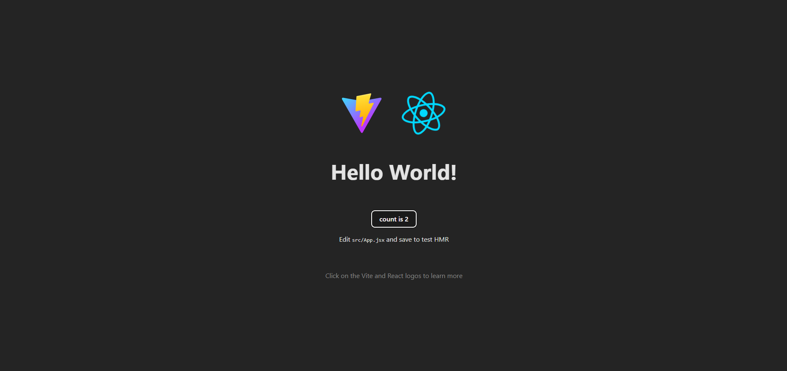

# Book-Emporium

-yellow>)
-blue>)
-darkorange>)
-darkred>)
-brightgreen>)
-purple>)
-green>)
-red>)
-darkblue>)

- An application that I created for testing components using Vitest, GitHub Actions, Git Hooks, and JavaScript alongside the library React.

## Description

- <strong>Motivation:</strong> My motivation for building this application was to create a tangible demonstration of test-driven development by building an application with an intentionally failing test case, which I subsequently corrected.
- <strong>Purpose:</strong> This project was built to showcase the practicality of my proficiency in test-driven development principles and methodologies.
- <strong>Problem Solved:</strong> This solves the problem of ensuring code quality and reliability by implementing automated testing and deployment through GitHub Actions.
- <strong>Learning Outcomes:</strong> In this project, I gained practical experience in applying agile methodologies through test-driven development, GitHub Actions, and Git Hooks. By integrating automated testing into the deployment pipeline, I learned how to enhance code quality and reduce risks associated with unstructured commits. This project deepened my understanding of the importance of rigorous testing in maintaining software reliability.

## Table of Contents (Optional)

Here is a table of contents to make it easy for users to locate which section they need.

- [Installation](#installation)
- [Usage](#usage)
- [Credits](#credits)
- [License](#license)

## Installation

1. Install Required Software:

- GitBash: A command-line interface for Git.
- VS Code: An integrated development environment (IDE).
- Node.js and NPM: A JavaScript runtime and package manager.

2. Clone Your Repository:

- Open GitBash.
- Navigate to the directory where you want to store your project.
- Run `git clone <your-repo-url>` to clone the repository.

3. Open the Project in VS Code:

- Launch VS Code.
- Open the cloned repository folder.

4. Install Dependencies:

- Open the terminal in VS Code (View > Terminal or `Ctrl + ``).
- Run `npm install` to install the node_modules packages listed in your package.json.

5. Build and Start the Project:

- Run `npm run start` to start the server.

## Usage

The GitHub Actions is used to show off my skill with testing using Vitest, and GitHub Actions through render with a static site.

- <strong>GitHub Actions Link</strong>

- [Website](https://github-actions-ydbo.onrender.com)

- <strong>GitHub Actions Screenshots</strong>

- 
- 

## Support

N/A

## Credits

People who worked on this project were Brennan Waterbury. You can contact the contributors through the GitHub profiles links listed here.

- <a href="https://github.com/bwater47" alt="GitHub Link">GitHub Profile - Brennan Waterbury</a>

## License

-
- This is an [https://choosealicense.com/licenses/mit/](https://choosealicense.com/licenses/mit/) license.

## Features

<strong>GitHub Actions</strong>: The GitHub Actions was created to showcase my skill in testing.

## Contributing

Contributing is allowed if you get in contact with me. Contact me by heading to my LinkedIn; otherwise, send me an email using the contact form on my portfolio.

- [Contributor Covenant](https://www.contributor-covenant.org/)

## Authors and Acknowledgment

MozDevNet. (07/25/24). Resources for developers, by developers. MDN Web Docs. https://developer.mozilla.org/en-US/

Bootcamp Spot. (07/25/24). https://bootcampspot.com/

W3Schools Online Web Tutorials. (07/25/24). https://www.w3schools.com/

Chatgpt. ChatGPT. (07/25/24). https://openai.com/chatgpt

• Please note: While ChatGPT was utilized to generate dialog content for the README file, it was not involved in the generation of any code, HTML edits, CSS edits, or other assets within the repository apart from this README specifically.

• All other sources, links, and information utilized within the project were obtained from the provided sources mentioned in this paragraph. This includes class materials, modules, TA guidance, instructor-provided resources, as well as communication through platforms such as Slack or Discord. Additionally, numerous links and resources were provided within the assignment instructions and demonstrated during class sessions.

## Roadmap

Tests: Failing

## Project status

In-Progress